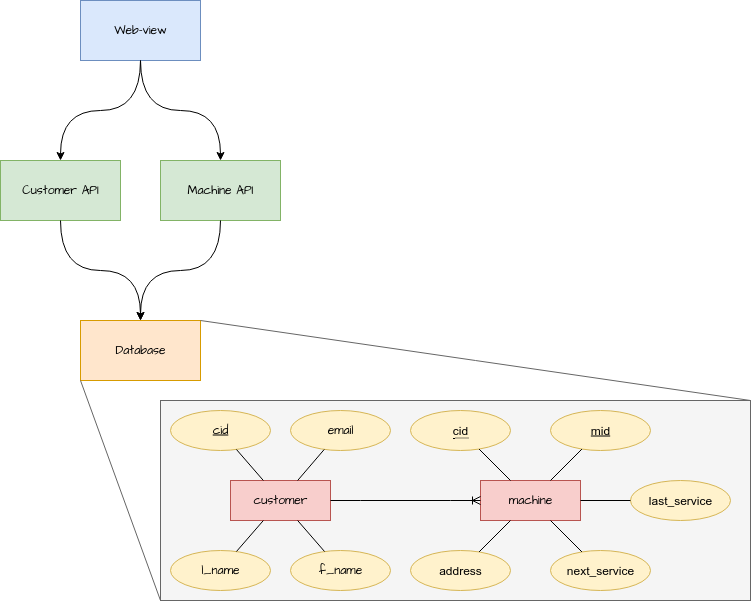

# Documents

These are the microservice specific documentations.

- [Customer API](./customer_api.md)
- [Machine API](./machine_api.md)
- [Database](./database.md)
- [WebView](./webview.md)

## Structure



## Kubernetes setup

### Secretes

```bash
kubectl create secret generic sp-credentials \
    --from-literal=postgres-password="secret_password" \
    --from-literal=customer-username="sp_customer" \
    --from-literal=customer-password="secret_password" \
    --from-literal=machine-username="sp_machine" \
    --from-literal=machine-password="secret_password"
```
